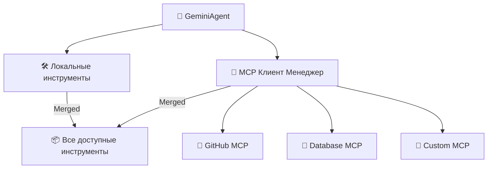

# 🔌 Руководство по интеграции MCP

## 🌐 Что такое MCP?

[Model Context Protocol (MCP)](https://modelcontextprotocol.io/) — это стандартизированный протокол для подключения ИИ-приложений к внешним инструментам и источникам данных. С MCP ваш агент может:

- 🔗 Подключаться к нескольким MCP серверам одновременно
- 🛠️ Использовать любые инструменты, предоставляемые этими серверами
- 📊 Получать доступ к базам данных, API, файловым системам, браузерам и многому другому
- 🔄 Объединять удаленные инструменты с локальными прозрачно

## 🚀 Быстрая настройка

### 1. Включите MCP в `.env`
```bash
MCP_ENABLED=true
```

### 2. Настройте серверы в `mcp_servers.json`

```json
{
  "servers": [
    {
      "name": "github",
      "transport": "stdio",
      "command": "npx",
      "args": ["-y", "@modelcontextprotocol/server-github"],
      "enabled": true,
      "env": {
        "GITHUB_PERSONAL_ACCESS_TOKEN": "ваш-github-токен"
      }
    },
    {
      "name": "filesystem",
      "transport": "stdio",
      "command": "npx",
      "args": ["-y", "@modelcontextprotocol/server-filesystem", "/tmp"],
      "enabled": true
    }
  ]
}
```

### 3. Запустите агента
```bash
python src/agent.py
```

Агент:
- 🔌 Подключится ко всем включенным MCP серверам
- 🔍 Обнаружит доступные инструменты
- 📦 Объединит их с локальными инструментами
- ✅ Готов к использованию

## 🏗️ Архитектура



## 📡 Поддерживаемые транспорты

| Транспорт | Описание | Кейс использования |
|-----------|----------|--------------------|
| `stdio` | Стандартный ввод/вывод | Локальные серверы, CLI инструменты |
| `http` | Потоковый HTTP | Удаленные серверы, облачные сервисы |
| `sse` | Server-Sent Events | Наследие HTTP серверов |

## 🛠️ Встроенные вспомогательные инструменты MCP

Как только MCP включен, эти вспомогательные инструменты становятся автоматически доступны:

- **`list_mcp_servers()`** — Список всех подключенных MCP серверов
- **`list_mcp_tools()`** — Перечисление всех доступных MCP инструментов
- **`get_mcp_tool_help(tool_name)`** — Показать справку/документацию для инструмента
- **`mcp_health_check()`** — Проверить статус здоровья всех серверов

## 📋 Предварительно настроенные серверы

`mcp_servers.json` включает шаблоны для этих популярных серверов:

| Сервер | Описание | Статус |
|--------|----------|--------|
| 🗂️ **Filesystem** | Операции с файловой системой | Готово |
| 🐙 **GitHub** | Доступ к GitHub API | Готово |
| 🗃️ **PostgreSQL** | Операции с базой данных | Готово |
| 🔍 **Brave Search** | Веб-поиск | Готово |
| 💾 **Memory** | Постоянное хранилище | Готово |
| 🌐 **Puppeteer** | Автоматизация браузера | Готово |
| 💬 **Slack** | Обмен сообщениями в Slack | Готово |

Включите то, что вам нужно, и добавьте свои API ключи.

## 🔧 Создание пользовательских MCP серверов

Создайте свой собственный MCP сервер используя [MCP Python SDK](https://github.com/modelcontextprotocol/python-sdk) с помощью FastMCP:

### Пример: Сервер пользовательского анализа

```python
from mcp.server.fastmcp import FastMCP
from mcp.types import Tool, TextContent

mcp = FastMCP("My Analysis Server")

@mcp.tool()
def analyze_text(text: str) -> str:
    """Анализирует тональность текста и извлекает ключевые инсайты."""
    # Ваша логика анализа здесь
    return f"Анализ: {text}"

@mcp.tool()
def generate_summary(content: str, max_length: int = 100) -> str:
    """Генерирует краткое содержание данного контента."""
    return content[:max_length] + "..."

if __name__ == "__main__":
    mcp.run()
```

### Регистрация пользовательского сервера

1. Сохраните ваш сервер в `src/tools/my_server.py`
2. Добавьте в `mcp_servers.json`:

```json
{
  "name": "my-analysis",
  "transport": "stdio",
  "command": "python",
  "args": ["src/tools/my_server.py"],
  "enabled": true
}
```

3. Перезапустите агента — ваши новые инструменты доступны!

## 🔐 Соображения безопасности

### Переменные окружения
Всегда используйте переменные окружения для чувствительных данных:

```json
{
  "env": {
    "GITHUB_TOKEN": "ваш-токен-здесь",
    "DB_PASSWORD": "ваш-пароль-бд"
  }
}
```

Текущая реализация передает значения `env` как есть процессам MCP серверов.
Если вы хотите брать их из переменных shell/.env, разрешите их перед записью `mcp_servers.json` (или генерируйте этот файл из шаблона в вашем процессе настройки).

### Песочница (Sandboxing)
Для ненадежных серверов рассмотрите:
- Запуск в изолированных Docker контейнерах
- Использование ограничивающих прав доступа к файлам
- Мониторинг вызовов инструментов на наличие вредоносных паттернов

## 🧪 Тестирование интеграции MCP

```python
from src.mcp_client import MCPClientManagerSync

manager = MCPClientManagerSync(config_path="mcp_servers.json")
manager.initialize()

status = manager.get_status()
print(status)

tools = manager.get_all_tools_as_callables()
print(f"Discovered tools: {list(tools.keys())}")
manager.shutdown()
```

## 🐛 Устранение неполадок

### Сервер не подключается
```bash
# Проверьте, запускается ли процесс сервера
python src/tools/my_server.py

# Проверьте, существует ли команда
which npx
```

### Инструменты не появляются
```bash
# Перезапустите агента
python src/agent.py

# Проверьте, существует ли команда сервера
which npx
```

### Проблемы с производительностью
- 📦 Отключите неиспользуемые серверы в `mcp_servers.json`
- 🚀 Используйте транспорт `http` для удаленных серверов
- 💾 Реализуйте кэширование результатов инструментов

## 📚 Ресурсы

- [Официальная документация MCP](https://modelcontextprotocol.io/)
- [MCP Python SDK](https://github.com/modelcontextprotocol/python-sdk)
- [Примеры FastMCP](https://github.com/modelcontextprotocol/python-sdk/tree/main/examples)

---

**Далее:** [Протокол роя (Swarm)](SWARM_PROTOCOL.md) | [Полный индекс](README.md)
