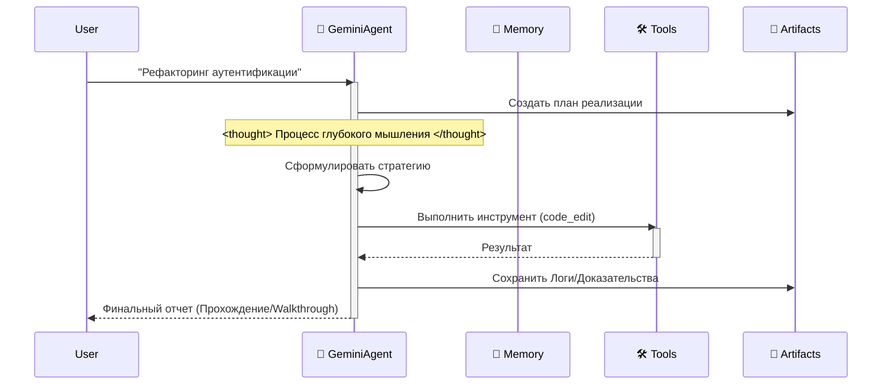

# 🌟 Философия проекта

## Видение Antigravity Workspace

В эпоху, богатую ИИ-IDE, целью было создание архитектуры корпоративного уровня всего за три шага: **Clone -> Rename -> Prompt**.

Этот проект использует осведомленность IDE о контексте (через `.cursorrules` и `.antigravity/rules.md`), чтобы внедрить полную **Когнитивную Архитектуру** прямо в файлы проекта.

Когда вы открываете этот проект, ваша IDE перестает быть просто редактором; она превращается в **"Знающего" Архитектора**.

## Зачем нам "Думающий" каркас?

При использовании Google Antigravity или Cursor для разработки с ИИ есть больная точка:

**IDE и модели мощные, но "пустые проекты" слабы.**

Каждый раз, начиная новый проект, мы повторяем скучные настройки:
- "Где должен лежать мой код: в src или app?"
- "Как определить функции инструментов, чтобы Gemini их распознал?"
- "Как заставить ИИ помнить контекст?"

Этот повторяющийся труд — трата творческой энергии. Идеальный рабочий процесс: **Git Clone -> IDE уже знает, что делать.**

Так был создан: **Antigravity Workspace Template**.

## 🧠 Ключевая философия: Artifact-First

Это рабочее пространство следует протоколу **Artifact-First** (Артефакты-сначала/ориентированность на артефакты). Агент не просто пишет код; он производит осязаемые результаты (Артефакты) для каждой сложной задачи.

### Три столпа

1. **Планирование**: `artifacts/plan_[task_id].md` создается до написания кода.
2. **Доказательства**: Логи и выводы тестов сохраняются в `artifacts/logs/`.
3. **Визуал**: Изменения пользовательского интерфейса генерируют скриншоты-артефакты.

Это гарантирует, что каждая задача оставляет след из доказательств, которые можно просмотреть, проверить и улучшить.

## 🛸 Как это работает

Агент следует строгому циклу "Think-Act-Reflect" (Думай-Делай-Рефлексируй), имитируя когнитивный процесс Gemini 2.0 Flash.

## 🔥 Убийственные фичи

- 🧠 **Движок бесконечной памяти**: Рекурсивная суммаризация автоматически сжимает историю. Лимиты контекста в прошлом.
- 🛠️ **Универсальный протокол инструментов**: Обычный ReAct паттерн. Просто зарегистрируйте любую Python-функцию в `available_tools`, и агент научится её использовать.
- ⚡️ **Нативно для Gemini**: Оптимизировано для скорости и возможностей вызова функций Gemini 2.0 Flash.
- 🔌 **Внешние LLM (OpenAI-формат)**: Вызывайте любой OpenAI-совместимый API через встроенный инструмент `call_openai_chat` (поддерживает OpenAI/Azure/Ollama).

---

**Далее:** [Руководство по быстрому старту](QUICK_START.md) | [Полный индекс](README.md)
