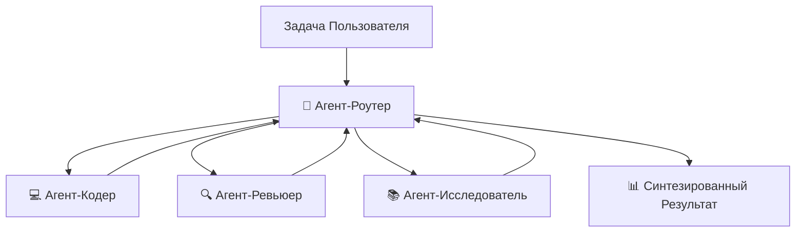

# 🔥 Мульти-агентный Протокол Роя (Swarm)

## 🪐 Архитектура: Паттерн Роутер-Воркер (Router-Worker)

Antigravity Workspace включает сложную систему мульти-агентного роя, основанную на паттерне Router-Worker. Это позволяет декомпозировать сложные задачи и обрабатывать их с помощью специализированных агентов, работающих согласованно.



## 🧠 Специализированные Агенты

### 🧭 Агент-Роутер (Router Agent)
**Роль**: Аналитик задач, стратег и дирижер

Роутер анализирует входящие задачи, определяет наилучшую стратегию декомпозиции, делегирует подзадачи специалистам и синтезирует финальные результаты.

**Возможности:**
- 🎯 Анализ сложных задач
- 📋 Стратегическое планирование
- 🔀 Распределение работы
- 🧩 Синтез результатов

### 💻 Агент-Кодер (Coder Agent)
**Роль**: Специалист по реализации

Пишет чистый, хорошо документированный, готовый к продакшену код, следуя конвенциям стиля кода Google.

**Специализация:**
- 🐍 Разработка на Python
- 🎨 Чистая архитектура кода
- 📝 Исчерпывающие docstrings
- 🧪 Покрытие тестами

### 🔍 Агент-Ревьюер (Reviewer Agent)
**Роль**: Эксперт по обеспечению качества (QA)

Проверяет реализации на корректность, безопасность, производительность и соответствие лучшим практикам.

**Специализация:**
- ✅ Оценка качества кода
- 🔒 Анализ безопасности
- ⚡ Оптимизация производительности
- 📋 Верификация лучших практик

### 📚 Агент-Исследователь (Researcher Agent)
**Роль**: Сборщик информации и следователь

Исследует решения, собирает контекст и предоставляет фундаментальные знания для сложных задач.

**Специализация:**
- 🔎 Исследование проблем
- 📚 Синтез информации
- 🧠 Сбор контекста
- 💡 Генерация идей (инсайтов)

## 🚀 Использование Роя

### Запуск интерактивного демо

```bash
python -m src.swarm_demo
```

Это запустит интерактивный промпт, где вы можете назначать задачи рою и наблюдать за сотрудничеством специалистов.

### Пример взаимодействия

```
🧭 [Router] С какой задачей вы хотите, чтобы я помог?
> Создай калькулятор, который поддерживает базовые математические операции, и проверь его на безопасность

🧭 [Router] Анализирую задачу...
📤 [Router → Coder] Создать калькулятор с операциями +, -, *, /
💻 [Coder] Создаю реализацию калькулятора...
📝 [Coder] Генерирую исчерпывающие тесты...
✅ [Coder] Реализация завершена!

📤 [Router → Reviewer] Проверить калькулятор на безопасность и лучшие практики
🔍 [Reviewer] Анализирую структуру кода...
🔍 [Reviewer] Оценка безопасности: Уязвимостей не найдено ✅
🔍 [Reviewer] Оценка производительности: Оптимально ✅
✅ [Reviewer] Ревью завершено!

🎉 [Router] Задача выполнена успешно!
📊 Финальное резюме:
   - Реализация: calculator.py ✅
   - Тесты: calculator_test.py ✅
   - Ревью: Все проверки пройдены ✅
```

### Программное использование

```python
from src.swarm import SwarmOrchestrator

swarm = SwarmOrchestrator()
result = swarm.execute("Build a file compression utility with error handling")
print(result)  # финальная синтезированная строка
```

## 🔧 Конфигурация

Текущая реализация использует встроенную карту воркеров в `src/swarm.py`.
Внешнего загрузчика `swarm_config.json` пока нет.

### Пользовательские агенты

Добавляйте пользовательских специализированных агентов, расширяя `BaseAgent`:

```python
# src/agents/custom_agent.py
from src.agents.base_agent import BaseAgent

class DataAnalystAgent(BaseAgent):
    """Специализированный агент для задач анализа данных."""
    
    def __init__(self, name="DataAnalyst"):
        super().__init__(name=name)
        self.specialization = "data analysis"
    
    def execute(self, task: str) -> str:
        """Выполнить задачу анализа данных."""
        # Реализация здесь
        return result
```

Зарегистрируйте в `swarm.py`:

```python
from src.agents.custom_agent import DataAnalystAgent

agents = {
    "coder": CoderAgent(),
    "reviewer": ReviewerAgent(),
    "researcher": ResearcherAgent(),
    "data_analyst": DataAnalystAgent(),  # Добавьте пользователя
}
```

## 📊 Мониторинг и Логирование

### Вывод во время выполнения

`SwarmOrchestrator.execute(..., verbose=True)` печатает логи делегирования и прогресса в stdout. Вы также можете инспектировать историю сообщений в памяти:

```python
from src.swarm import SwarmOrchestrator

swarm = SwarmOrchestrator()
swarm.execute("Build and review a calculator", verbose=False)
messages = swarm.get_message_log()
print(messages)
```

Текущая реализация не записывает автоматически логи/артефакты роя на диск.

## ⚡ Советы по производительности

### Оптимизация выполнения
- 🎯 Делайте описания задач четкими и сфокусированными
- 📦 Предварительно загружайте контекст для лучшего понимания агентом
- ⏱️ Делайте подзадачи конкретными, чтобы делегирование роутера было предсказуемым

### Управление ресурсами
- 🚫 Отключайте или удаляйте неиспользуемых воркеров прямо в `src/swarm.py`
- 💾 Реализуйте кэширование результатов
- 🧹 Периодически очищайте старые артефакты

## 🐛 Устранение неполадок

### Агенты не подключаются
```bash
# Проверьте, может ли swarm инициализироваться
python -c "from src.swarm import SwarmOrchestrator; SwarmOrchestrator(); print('ok')"
```

### Выполнение задачи зависает
```bash
# Запустите с verbose=False, чтобы уменьшить шум в консоли и инспектировать шину сообщений
python -c "from src.swarm import SwarmOrchestrator; s=SwarmOrchestrator(); s.execute('test', verbose=False); print(s.get_message_log())"
```

### Низкое качество результатов
- 📚 Предоставьте больше контекста рою
- 🎯 Будьте более конкретны в описаниях задач
- 🔄 Включите агента-ревьюера для проверок качества

## 📚 Примеры

### Пример 1: Разработка веб-скрапера
```python
from src.swarm import SwarmOrchestrator

swarm = SwarmOrchestrator()
result = swarm.execute(
    """
    Build a web scraper that:
    1. Fetches news articles from a website
    2. Extracts headline, author, date
    3. Stores in JSON format
    4. Includes error handling
    """
)
```

### Пример 2: API Сервер с тестированием
```python
result = swarm.execute(
    """
    Create a Flask REST API with:
    - GET /users endpoint
    - POST /users endpoint with validation
    - Comprehensive unit tests
    - Security review for vulnerabilities
    """
)
```

## 📞 Продвинутые темы

- **Разработка пользовательских агентов**: Расширение `BaseAgent` для специализированных доменов
- **Пользовательская оркестрация**: Расширение `SwarmOrchestrator` для разных политик маршрутизации/выполнения
- **Меж-агентная коммуникация**: Использование передачи сообщений для сложной координации
- **Верификация результатов**: Реализация пользовательских стратегий верификации

См. [Полный индекс](README.md) для дополнительных ресурсов.

---

**Далее:** [Zero-Config возможности](ZERO_CONFIG.md) | [Полный индекс](README.md)
